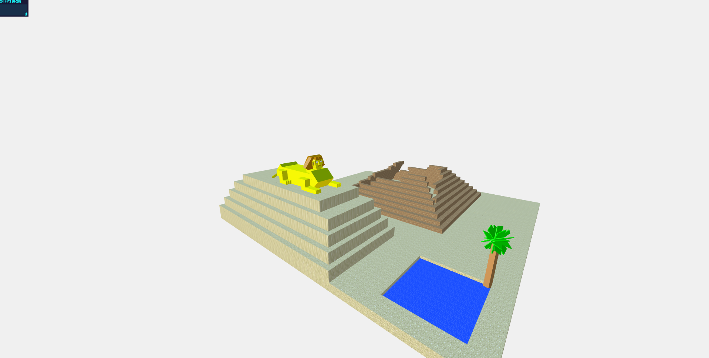

<meta charset="utf-8">

# DESCRIZIONE

L'idea inziale è stata quella di creare un ambiente egizio, con una o più piramidi che vengono generate 
nella scena mano a mano che il tempo passa e una sfinge a cui applicare una certa animazione.
La scelta è stata quella di modificare il file StartingCode-withLights.html per ottenere un effetto migliore, 
applicando però le ombre alla sola sfinge. 
Per quanto riguarda la scelta tra applicare una texture al terreno o creare un "video" della scena, abbiamo scelto
il video. Questo è stato ottenuto applicando alla camera prospettica traslazioni e rotazioni in modo da dare una vista 
completa della scena.
Infine il progetto fa uso di varie librerie di Three.js (quella incluse inzialmente) contenute in lib, una texture 
per le piramidi contenuta in textures,un file PyramidsAndSphinx.html contenente tutto il codice ed una cartella snapshots con
alcuni esempi.

----------------------------------------------------------------------------------------------------------------------------

# RISULTATI

La scena è composta da due piramidi che vengono create durante i movimenti della telecamera ed una sfinge che è presente 
dall'inizio della scena. La sfinge ha una animazione che si ripeterà in loop dall'inizio della scena.

# IMMAGINI

--------------------------------------------------------------------------------------------------------------------------------

# PROCESSO

La scena è stata realizzata creando le piramidi ricorsivamente e la sfinge con la giustapposizione di vari cubi in modo da darle una 
forma credibile. Il colore del terreno è ottenuto dalla combinazione di una HemisphereLight e di una DirectionalLight che illumina la sfinge. 
Il colore è stato cambiato in un colore rassomigliate alla sabbia; abbiamo modificato la grandezza del piano e la DirectionalLight, facendola
provenire da un cubo rappresentante il sole.
Il tutto è stato fatto in JavaScript e usando la libreria Three.js, quindi nessun editor o altro è stato usato. 
Il processo è stato diviso in due parti: una persona ha svolto l'animazione della camera e la generazione delle piramidi mentre l'altra 
ha realizzato la sfinge e la sua animazione.

# NOTE

A causa di una politica di sicurezza di google-chrome le texture della piramide non vengono visualizzate e le piramidi appariranno nere lucenti.
Con altri browsers il problema non si verifica.
Il file è stato testato con google-chome; con altri browsers alcune animazioni potrebbero risultare ritardate portando allo sfasamento delle 
animazioni successive.

<!-- Markdeep: -->

 