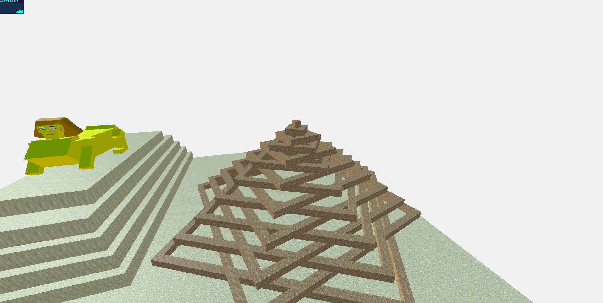

<meta charset="utf-8">

# DESCRIZIONE

L'idea inziale è stata quella di creare una piccola scena interattiva con un cubo che poteva muoversi avanti, di lato ed indietro
con i comandi WASD e che poteva saltare con SPACE. Il giocatore doveva superare un percorso ad ostacoli per arrivare alla vittoria.
La seconda idea è stata quella di creare un ambiente egizio, con una o più piramidi che vengono generate 
nella scena mano a mano che il tempo passa e una sfinge a cui applicare una certa animazione.
La scelta finale è stata quella di creare un terreno utilizzando una heightmap a cui aggiungere dei modelli con delle animazioni 
associate, modificando i file StartingCode-withLights.html e StartingCode-heightmap.html.
Infine il progetto fa uso di varie librerie di Three.js (quella incluse inzialmente) contenute in lib, le textures
per le piramidi, il terreno e l'acqua sono contenute nella cartella textures, un file index.html contenente tutto il codice ed 
una cartella snapshots con alcuni esempi.

----------------------------------------------------------------------------------------------------------------------------

# RISULTATI
La scena è composta da un terreno ottenuta da una heightmap modificata a cui vengono applicate delle textures.
Al terreno sono stati aggiunti vari modelli come la sfinge, una piramide ed una palma.
La sfinge ha due animazion: una che inizia dopo un certo lasso di tempo senza poi ripetersi ed un'altra che continua
in loop.
La piramide ha un'animazione che inizia dopo la sua generazione e continua in loop.

# IMMAGINI

--------------------------------------------------------------------------------------------------------------------------------

# PROCESSO

La scena è stata realizzata creando le piramidi iterativamente e la sfinge con la giustapposizione di vari cubi in modo da darle una 
forma credibile. Il colore del terreno è ottenuto dalla combinazione di una HemisphereLight,di una DirectionalLight che illumina la scena e 
di una texture "sand.png" applicata al terreno.
Il tutto è stato fatto in JavaScript e usando la libreria Three.js, quindi nessun editor o altro è stato usato. 
Il processo è stato diviso in due parti: una persona ha svolto la generazione delle piramidi e la relativa animazione mentre l'altra 
ha realizzato la sfinge e la sua animazione. 

# NOTE

Il file è stato testato con google-chome; con altri browsers alcune animazioni potrebbero risultare ritardate portando allo sfasamento delle 
animazioni successive.

<!-- Markdeep: -->

 